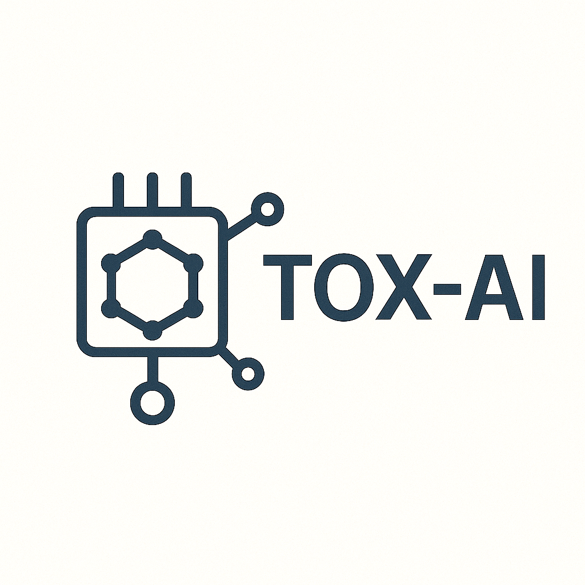

# TOX-AI
Python code from the TOX-AI PhD project at King's College London.

The TOX-AI project (2021-2025), jointly funded by BBSRC and the Food Standards Agency, has developed cutting-edge AI-powered QSAR models for predicting toxicological properties of small molecules. These models are to be released in open-source, under this repository.

If you wish to use any of the code, then please cite their associated publications.

  

