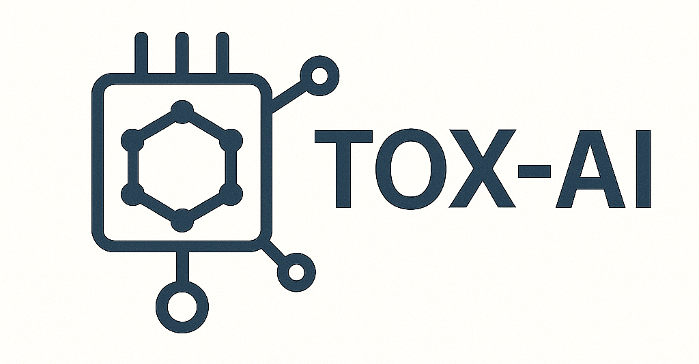

# TOX-AI
Python code from the TOX-AI PhD project at King's College London.

The TOX-AI project (2021-2025), jointly funded by BBSRC and the Food Standards Agency, has developed cutting-edge AI-powered QSAR models for predicting toxicological properties of small molecules. These models are to be released in open-source, under this repository.

If you wish to use any of the code, then please cite their associated publications.

  

3 sub-projects of TOX-AI are provided here, so far. They are as follows:

| Sub-Project | Folder | Purpose | Citation(s) |
|----------|---------|---------|---------|
| Mutagenicity Models | `mutagenicity` | Development of simple AI-powered QSAR models, to predict Ames mutagenicity, using MLPs and innovative forms of feature engineering. | [_Kalian et al. (2023) (1)_](https://doi.org/10.3390/toxics11070572) [_Kalian et al. (2023) (2)_](https://doi.org/10.1016/B978-0-443-15274-0.50432-7) |
| Transfer Learning on GCNs / SARMs Case Study | `transfer_learning_gcns` | Predict organ-specific toxicity of SARMs, using GCNs, with exploration of benefits of transfer learning via pre-training on unrelated biomedical datasets. | [_Kalian et al. (2025) (1)_](https://doi.org/10.1101/2025.08.27.672581) |
| GNNs Comparison | `comparing_gnns` | Compare the performance and implications of different GNN architectures, over varied toxicological assay data environments. | [_Kalian et al. (2025) (2)_](https://arxiv.org/abs/2507.17775) |

Additionally, 2 folders of experimental scripts are provided - intended to publish exploratory work, while not representing readily deployable models:

| Topic | Folder | Purpose |
|----------|---------|---------|
| Generative AI | `generative_ai_experiments` | Exploratory work on generative AI (mostly VAEs and GANs). |
| Transformer Models | `transformer_experiments` | Exploratory work on transformers, for processing SMILES strings. |
